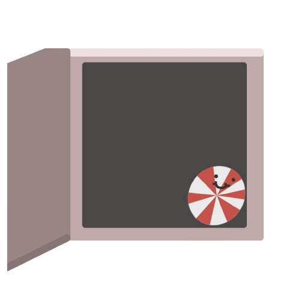

<p align="center">
  <br>
  
  <br>
  <h1 align="center">MintVaulty</h1>
  <div align="center">
      <span style="font-size:22px;">Strong passwords. No sugarcoating.</span>
  </div>
  <br><br>
  <div align="center">
    <a href="#Install">Install</a>
    &nbsp;&nbsp;&nbsp;|&nbsp;&nbsp;&nbsp;
    <a href="#usage">Usage</a>
    <a>&nbsp;&nbsp;&nbsp;|&nbsp;&nbsp;&nbsp;</a>
    <a href="https://github.com/snowballero/MintVaulty-Python/blob/main/LICENSE">License</a>
  </div>
</p>

<h1>What is MintVaulty?</h1>
<h3>MintVaulty is a cryptographically secure password generator. It runs offline, has no telemetry and doesn't steal any personal information. I designed it to be open-source, so that everyone can view the code.</h3>
<h1 id="Install">Installation</h1>
<h3>1. Clone the repo</h3>

  ```bash
    git clone https://github.com/snowballero/mintvaulty-python
  ```

<h3>1.1 Change directory to it</h3>

```bash
cd mintvaulty-python
```

<h3>1.2 Execute the file</h3>
    <h3>[*] Windows</h3>

  ```bash
    python mintvaulty.py
  ```
    
  <h3>[*] Linux / macOS</h3>

  ```bash
    python3 mintvaulty.py
  ```
<br>
<h3>2. Or all in one command..?</h3>
    [*] Linux / macOS
    
  ```bash
    git clone https://github.com/snowballero/mintvaulty-python && cd mintvaulty-python && python3 mintvaulty.py
  ```
    
  [*] Windows
  ```bash
    git clone https://github.com/snowballero/mintvaulty-python; cd mintvaulty-python; python mintvaulty.py
  ```

## Install through release
<a href="https://github.com/snowballero/mintvaulty-python/releases/latest">

</a>
<h1 id="usage">Usage</h1>

Generate a password:
<h3>Amount of letters: [input, e.g 8]</h3>
<h3>Amount of numbers: [input, e.g 4]</h3>
<h3>Amount of symbols: [input, e.g 2]</h3>
<h3>The program will then ask you to save, which you can reply with y(Y) to continue saving, or n(N) to exit.</h3>

<h2>EXAMPLE:</h2>
<br>

<br>
After saving the file , it will be located in your current directory.
